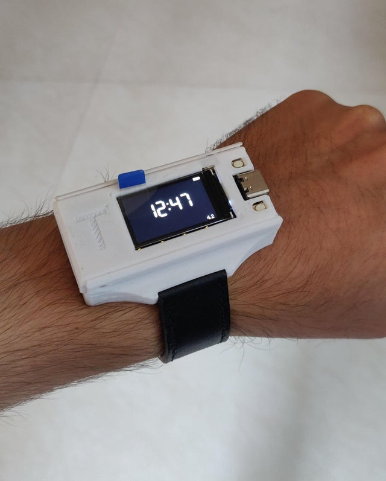

# [WIP]esp32_smartwatch
DIY smartwatch.

I'm not a professional at programming, and this project is just an effort to refine my skills at it. Do recommend changes and point out bugs! 

# Features 
	Time (from WiFi)
	Steps count  	around 97% accuracy
	Calorie count 	very experimental so far - <30% accurate
	
# User Setup
### Variables you will want to set
	in Smartwatch.ino
		!define	bluetoothLogging
			DebuggingScreens
	in time.ino
		define 	(WiFi)credentials
			gmtOffset_sec
			daylightOffset_sec
			
### Variables you can play around with
	in tft.ino
		define 	screen colors
	in battery.ino
		define 	battery sizes

# Changelog
### v0.45 (Current)

	Better ino grouping and naming
v0.41

	Improved accuracy in measurement of steps, around 96-97%

v0.4
	
	Fix for font size when steps go into 5 digits
	Better movement timeout
	Optimized range of values for walking
	Added media to readme.md
	
v0.33

	Walking bug fix
	Better comments

v0.32

	Minor fixes
	Better comments
	Rewrote walking code (around 90% accuracy)
	n-step Debounce for movement
	
v0.22
	
	Better screen switching
	Fix in walking time
	Updated instructions in flashing and ToDo list
	Code cleanup
		
v0.21
	
	Easy toggle for bluetooth logging and debugging screens	
	Automatic screen detection	
	Fix in walking

_Changelog being maintained since v0.2_

# Libraries used
  	TFT_eSPI.h - https://github.com/Bodmer/TFT_eSPI
  	SPI.h - built-in
  	WiFi.h - with esp32 
  	time.h - built-in
  	Wire.h - built-in

# Hardware used
  	TTGO T-Display
  	GY-521
  	400mAh LiPo
  	Case STL here: https://www.thingiverse.com/thing:4730124

# Credit
	Must credit all those who have written those extensive libraries as part of the effort in this project.
	Without them, I couldn't have reached so far.

